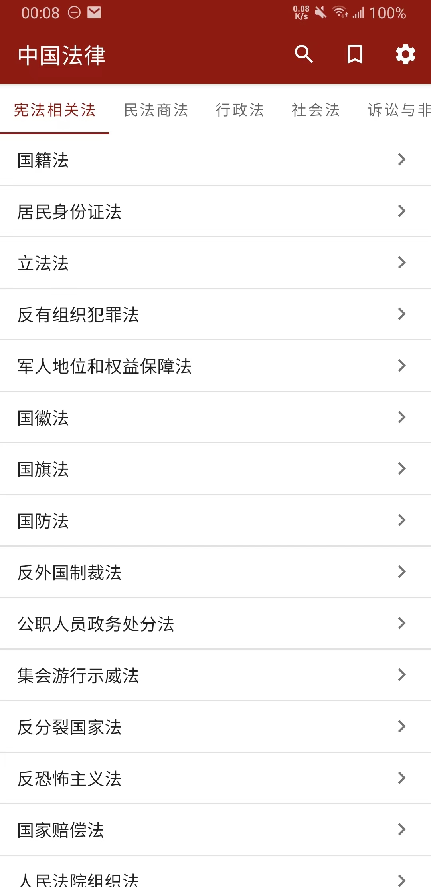
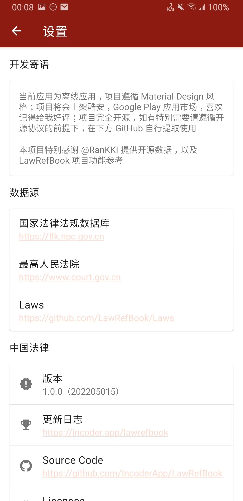

# LawRefBook

开发环境说明，[Android Studio 4.2 及以上版本，JDK 必须是 JDK11](https://developer.android.google.cn/studio/releases/past-releases?hl=zh-cn#4-2-0) ，因此该项目的 JDK 版本取决于你的运行环境，低版本 Android Studio，要求 JDK8+ 及以上即可

[](https://developer.android.google.cn/studio/releases)
[](https://developer.android.google.cn/reference)
[](https://jdk.java.net/java-se-ri/11)
[](https://docs.gradle.org/7.3.3/release-notes.html)
[](https://github.com/IncoderApp/LawRefBook/actions)

1. 当前版本为离线应用；
2. 应用遵循 Material Design 风格；
3. 应用上架 Coolapk，Google Play 应用市场；
4. 应用完全开源，如有需要请遵循开源协议自行提取

> 本项目特别感谢 [@RanKKI](https://github.com/RanKKI) 提供开源数据，并使用了 [LawRefBook](https://github.com/RanKKI/LawRefBook) 项目 icon，以及部分功能参考

## Download

[](https://www.coolapk.com/apk/app.incoder.lawrefbook) [](https://play.google.com/store/apps/details?id=app.incoder.lawrefbook)

## Preview

| 主页 | 内容页 | 个人页 |
|:-----------:|:-----------:|:-----------:|
||||
| 历史 | 目录 | 收藏 |
||||
| 搜索文章 | 搜索内容 | 等等 |
|||……|

## Release Note

### 1.0.0（20220601）

1. 使用 [Laws](https://github.com/LawRefBook/Laws) 项目作为数据源，聚合 [国家法律法规数据库](https://flk.npc.gov.cn)，[最高人民法院](https://www.court.gov.cn) 网站数据
2. 离线使用
3. 全文，片段法条收藏
4. 文本分享
5. 层级目录
6. 高亮检索

### 1.1.0

* [x] 项目数据以 [git submodule](https://git-scm.com/book/en/v2/Git-Tools-Submodules) 方式依赖
* [ ] 应用手动更新数据源选项
* [x] 数据按照法条解析
* [ ] 目录可定位，以及流畅的滚动效果
* [ ] 分享内容生成图片
* [ ] 应用上架 F-Droid

### 2.0.0

* [ ] 黑夜模式
* [ ] 文字大小调整
* [ ] 行间距调整
* [ ] 法条间距调整
* [ ] 动态适配不同长度文章标题

## Command

### git

```shell
# update submodule
cd app/src/main/assets/ 
git pull

hint: pulling without specifying how to reconcile divergent branches is
hint: discouraged. you can squelch this message by running one of the following
hint: commands sometime before your next pull:
hint: 
hint:   git config pull.rebase false  # merge (the default strategy)
hint:   git config pull.rebase true   # rebase
hint:   git config pull.ff only       # fast-forward only
hint: 
hint: You can replace "git config" with "git config --global" to set a default
hint: preference for all repositories. You can also pass --rebase, --no-rebase,
hint: or --ff-only on the command line to override the configured default per
hint: invocation.
```

## License

```text
Copyright 2022 Jerry xu

Licensed under the Apache License, Version 2.0 (the "License");
you may not use this file except in compliance with the License.
You may obtain a copy of the License at

    http://www.apache.org/licenses/LICENSE-2.0

Unless required by applicable law or agreed to in writing, software
distributed under the License is distributed on an "AS IS" BASIS,
WITHOUT WARRANTIES OR CONDITIONS OF ANY KIND, either express or implied.
See the License for the specific language governing permissions and
limitations under the License.
```
