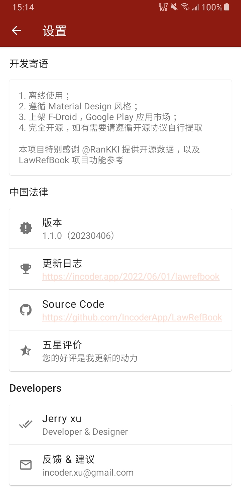
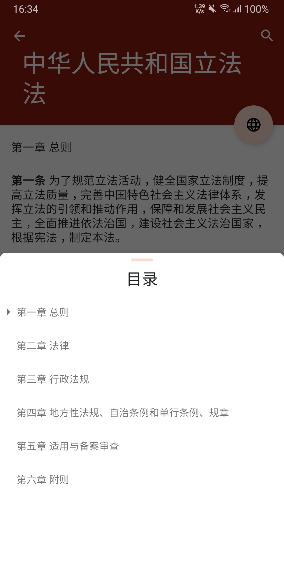
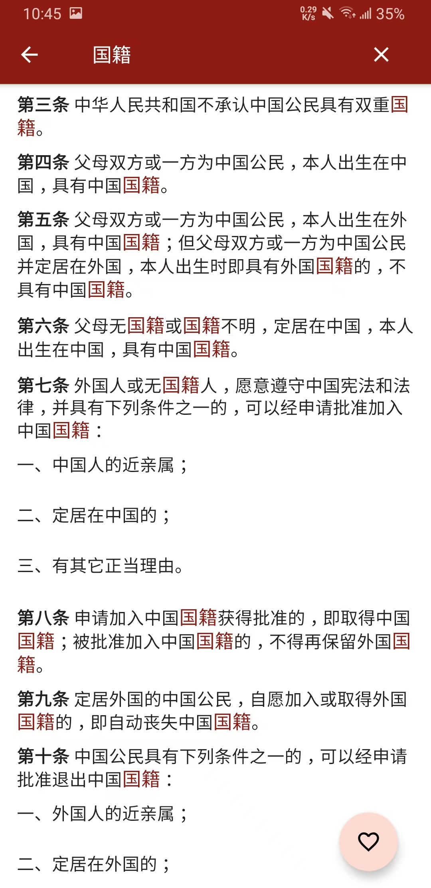
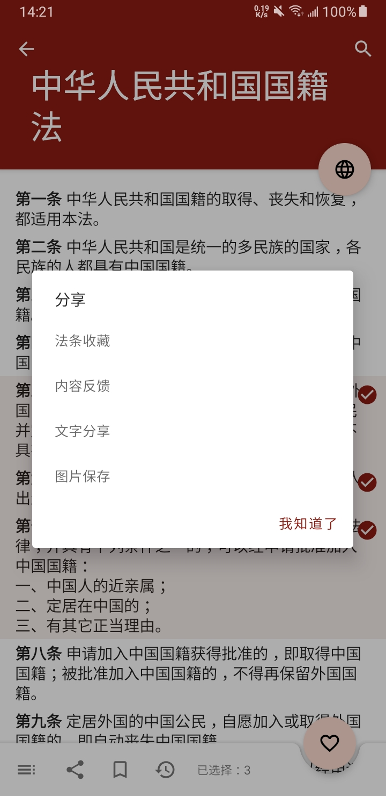

# LawRefBook

开发环境说明

1. Android Studio >= 4.2，[建议 JDK11+](https://developer.android.google.cn/studio/releases/past-releases?hl=zh-cn#4-2-0) 及以上， 
2. Android Studio < 4.2，要求 JDK8+ 及以上即可

因此该项目的 JDK 版本取决于你的运行环境

[](https://developer.android.google.cn/studio/releases)
[](https://developer.android.google.cn/reference)
[](https://jdk.java.net/java-se-ri/11)
[](https://docs.gradle.org/8.0/release-notes.html)

[](https://github.com/IncoderApp/LawRefBook/actions)

1. 离线使用；
2. 遵循 [Material Design2](https://m2.material.io) 风格；
3. 上架 F-Droid，[Google Play](https://play.google.com/store/apps/details?id=app.incoder.lawrefbook)  应用市场；
4. 完全开源，如有需要请遵循开源协议自行提取

> * 本项目特别感谢 [@RanKKI](https://github.com/RanKKI) 提供开源数据，并使用了 [LawRefBook](https://github.com/RanKKI/LawRefBook) 项目 icon，以及部分功能参考
> * 国内应用市场上架一言**难**尽，不再上架国内应用平台

## Download

[](https://play.google.com/store/apps/details?id=app.incoder.lawrefbook) [](https://github.com/IncoderApp/LawRefBook/releases)

[//]: # ()
[//]: # (> LawRefBook 是一个可重复构建的应用，你不需要担心 F-Droid 和其他应用商店签名问题，参见：[向可重现的 F-Droid 前进]&#40;https://f-droid.org/zh_Hans/2023/01/15/towards-a-reproducible-fdroid.html&#41;)

## Preview

|                                主页                                |                                内容页                                 |                            个人页                             |
|:----------------------------------------------------------------:|:------------------------------------------------------------------:|:----------------------------------------------------------:|
|            |          |    |
|                                历史                                |                                 目录                                 |                             收藏                             |
|         |           |  |
|                               搜索文章                               |                                搜索内容                                |                             分享                             |
|  |  |     |

## Release Note

### 1.0.0（20220601）

1. 使用 [Laws](https://github.com/LawRefBook/Laws) 项目作为数据源，聚合 [国家法律法规数据库](https://flk.npc.gov.cn)，[最高人民法院](https://www.court.gov.cn) 网站数据
2. 离线使用
3. 全文，片段法条收藏
4. 文本分享
5. 层级目录
6. 高亮检索

### 1.1.0（20250412）

1. [x] 数据 [1a26dbe](https://github.com/LawRefBook/Laws/tree/1a26dbeebd942b0782fb0d7d282e4c4732b22fa1) 按照法条解析
2. [x] 目录可定位
3. [x] 内容标题剧中显示
4. [x] 分享内容生成图片（限制数量：3条法条）
5. [x] 隐私协议版本管理

### 1.1.1（20250514）

1. [x] 数据 [2f4c5c2](https://github.com/LawRefBook/Laws/tree/2f4c5c23716267af9dbebbbbd6cbbf732b101981) 按照法条解析
2. [x] 应用隐私更新，

### 1.2.0

1. [ ] 平板支持
2. [ ] 自定义可展示分类
3. [ ] 目录与内容互相联动
4. [ ] 手动导入数据源选项
5. [ ] 应用上架 F-Droid
6. [ ] Github Action & F-Droid CI 脚本

> [重构数据源数据结构](https://github.com/IncoderApp/Laws)，解析源数据生成离线 SQLite3 可手动导入数据

### 1.2.1

1. [ ] 黑夜模式
2. [ ] 可自定义主题
3. [ ] 文字大小调整
4. [ ] 行间距调整
5. [ ] 法条间距调整
6. [ ] 超长文章标题滚动显示

## License

```text
Copyright 2022 ~ 2025 Jerry Xu

Licensed under the Apache License, Version 2.0 (the "License");
you may not use this file except in compliance with the License.
You may obtain a copy of the License at

    http://www.apache.org/licenses/LICENSE-2.0

Unless required by applicable law or agreed to in writing, software
distributed under the License is distributed on an "AS IS" BASIS,
WITHOUT WARRANTIES OR CONDITIONS OF ANY KIND, either express or implied.
See the License for the specific language governing permissions and
limitations under the License.
```
